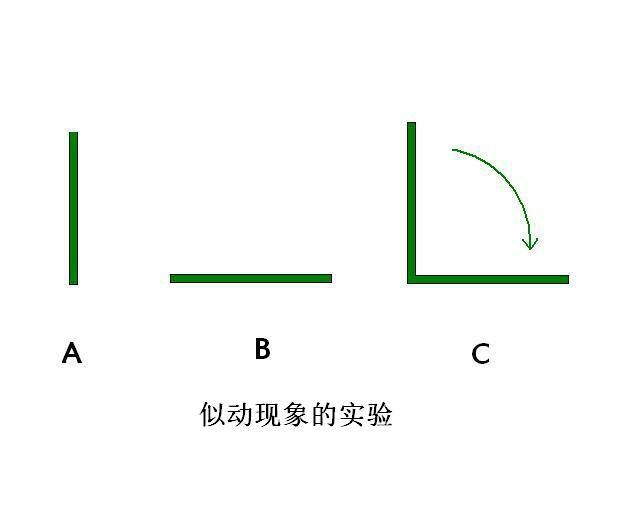

## 淫念到底有多快

##    似动错觉与切换淫念 

要戒意淫就必须先对淫念有一个了解。那么淫念是以怎样的形式呈现，又以怎样的速度运行的呢？要搞清这个问题先要对似动现象有一个了解。
  似动现象是实际上两个不动的静止之物，很快相继出现使人产生物体在运动的错觉。最有代表性的似动现象叫做β运动。如图所示，在不同位置上的两条直线A和B，如果以适当的时间间隔依次先后呈现A和B，就能看到C那样的A倒向B的运动。实际生活中电影画面的形成就属于β运动。

此主题相关图片如下：

根据德国心理学家韦特海默德的研究，β运动受两个刺激物先后呈现的时间间隔长度的影响。在一般情况下，时间间隔短于0.03秒或长于0.2秒都不会产生似动现象。间隔时间短于0.03秒，观察者会认为是两个刺激物同时出现。间隔时间长于0.2秒，观察者认为是两个刺激物先后出现。当时间间隔为0.06秒时，可以非常清楚的看到β运动。此时的似动现象叫做最适似动或Ф现象。最适似动可用柯尔似动律表示，即Ф=f（s/ig）。电影画面的形成是一幅幅的静止画面（底片）以每1/24秒的速度切换一张，即两幅画面以间隔0.04秒的速度呈现出来，给人以画面人物真实活动的似动现象错觉。

当我们淫念的生起时，不是以抽象形式而是以活生生的具象形式呈现在我们心中的。我们幻想自己和异性行淫欲之事就如同黄色电影及三级片中男女行淫的淫秽画面一样。意念中人的动作速度与电影画面中人物运动速度完全是相同的。由于淫念具有单独性及连续性（请详阅末学《如何戒意淫》一文），如果对意淫的幻想画面进行如同电影画面底片一样的切割，将意淫画面切割成一张张微细行淫情境（底片），那么我们的前一微细淫念（行淫情境）与后一微细淫念（行淫情境）的间隔时间就是0.04秒。正是由于我们幻想中的一张张微细行淫情境（底片）以这种速度转换，才使得我们沉浸在自己与异性行淫的幻想中而不能自拔。如果我们想要将淫念切换到正念，就必须以0.03秒<念速<0.06秒的速度才能进行成功的切换。

 那么问题来了，有人会不自信的问，要以这么快的速度切换淫念是不是有点难？事实上一点都不难，人人皆可做到。要知道我们每个人心念的速度都是非常快的。我们可以对自己每天的起心动念做一个观察，从早晨一睁眼开始到晚上入睡，在一天当中妄念起起落落，从一个念头到另一个念头，都不知道被我们切换了多少次了。可是为什么切换别的妄念容易，轮到切换淫念就那么难呢？原因只有一个，是因为我们多生多劫以来在生死轮回中形成的对淫欲强烈贪恋之心在障碍我们！

##  看看我们的欲习有多重

 我们每个人在生死轮回中不断流转，都不知道轮回多少次了，每轮回一次我们对淫欲的贪执习气就强烈了一分，淫欲的业力也加重了一分。可以说我们的淫欲业力是很重的。

何以见得呢？我们不妨算笔账，看看我们的淫欲习气到底有多重。假设我们每一世都生而为人，25岁结婚（古代人十几岁就结婚了，我们的过去世多数是古代）至70岁死亡，每一世的结婚史为45年。邪淫就不必提了，婚后总要行婚姻之内的正淫吧?再假设每月行正淫三次，一年就是36次，10年是360次，现在不按45年计算，减去最后5年的年老体衰按40年计算，那么我们一生中就行1440次正淫！那么100世就是144000次！那么1000世就是1440000次（100多万次）！那么10000世呢？……多么可怕的数字！佛说：若罪业有体相（具体物质形象）故，尽虚空不能容受。此言诚实不虚！

虽说佛法只是禁止在家人行邪淫，也认为在家人行婚姻之内的正淫是合情合理的，但是正淫也是淫行。每一次的正淫现行（行为）都会形成淫欲的业力与淫欲种子习气。这种业力与习气会深深地藏入我们的第八识阿赖耶识中。由于阿赖耶识是我们生死轮回的根本，有能执与所执的功能，淫欲种子习气会生生世世跟着我们，一点都不会失去。转世之后如果一旦碰到淫欲的外缘（男女声色），种子习气就会爆发，种子就会起现行：产生淫欲的念头与行为。就这样现行而种子，种子而现行，我们一世世的在生死轮回中不断流转，不断造业。这就是佛为什么说“淫心不断、尘不可出”，为什么出家比丘连正淫也要断的原因（不造淫业)；这就是为什么人在小时候就会贪恋异性、起邪淫念头的原因；这就是邪淫为什么这么难戒的原因！所以要戒邪淫，追本溯源连正淫也要加以节制，方是上上之策。

  我们每个人一生下来就带来了前世的淫业，可谓个个业力深重。既然我们的业力与淫欲习气深重，一旦染上邪淫恶习岂不是很难戒掉了吗？

##   不要小看了自己

 虽然我们的淫欲习气深重，但是只要我们真想戒淫，淫习绝对戒得掉。

  从教理上来看，淫习绝对戒得掉。佛在证道那一刻说道：一切众生皆具如来智慧徳相，只因妄想执着不能证得。每个人的心性都具有如佛一般的智慧，所以不要小看了自己心性本有的能力。佛教观点认为“一切唯心”、“心物一元”。唐朝玄奘大师所著的唯识学著作《八识规矩颂》指出，我们的第八识阿赖耶识具有“受薰持种根身器”的作用。受薰，如抽烟者慢慢染上熏上，谓之熏习，也就是气质变化的意思；持种就是保持这些种子习气永远不失；根，指我们生理的六根；身，指身体；器，指整个三界宇宙一切物理世界的物质都在内。第八识阿赖耶识具有能生起人类生命的生理（根和身）与物质世界（器世界）等作用，远远超越了我等业力凡夫的想象。现代科学最前沿的量子力学也认为意识与物质不是单独存在、互不相干的，意识与物质是相互联系的，意识参与了物质的产生，这一观点证实了佛法理论的正确性。既然天地万物皆由我们心识所造，既然我们的心识有如此巨大的功能，“一切唯心造”，只要我们痛下决心，淫习自然戒得掉。

  从现实当中来看，无数曾经犯淫习的人经过自己的努力最终都戒除了淫习。这也是淫习绝对戒得掉的佐证。

 所以，大家不要被淫习的一时强大假象所惑，只要痛下决心，绝对可以把淫习彻底戒掉。

##    余     话

了解了淫念转换的速度，我们又怎能不严格反省自己的起心动念呢?知道了自己淫欲习气的深重，我们又怎会不对淫欲保持战战兢兢的态度呢？世上无如人欲险，几人能不误平生！路漫漫其修远兮！在戒意淫这条漫长的人生路上，让我们共同努力战胜淫欲，迎接灿烂美好的明天！   

（本文观点只是个人的一点思考，仅供大家参考。）