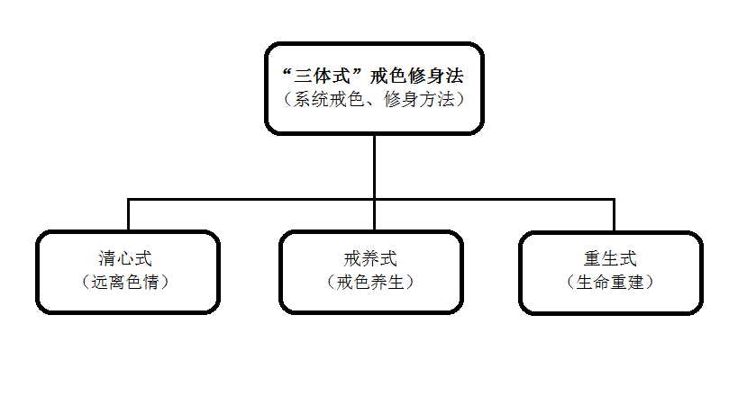
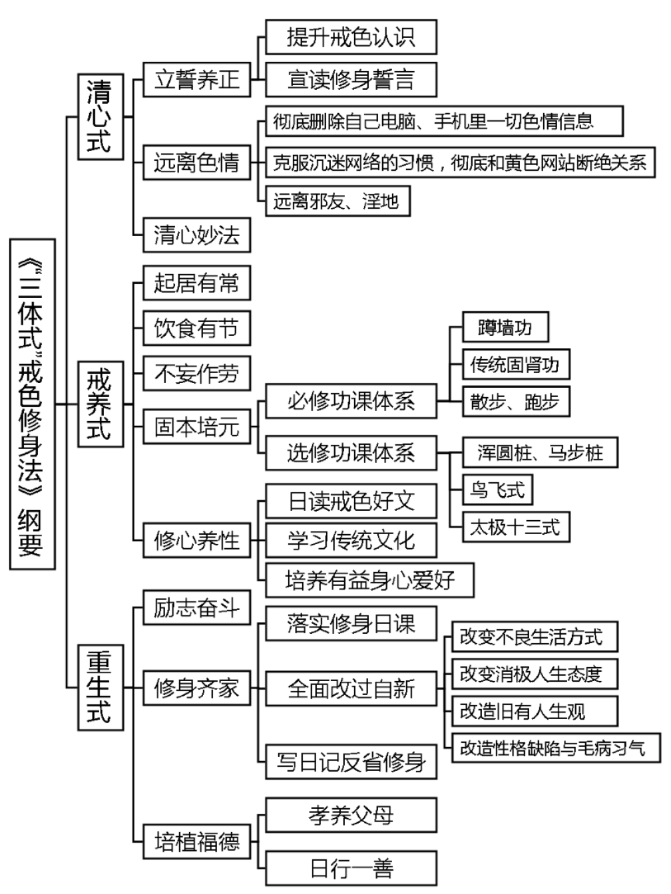
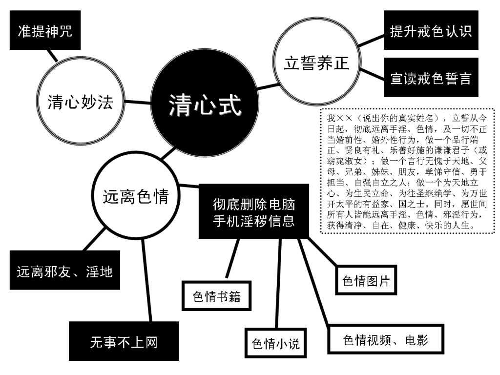
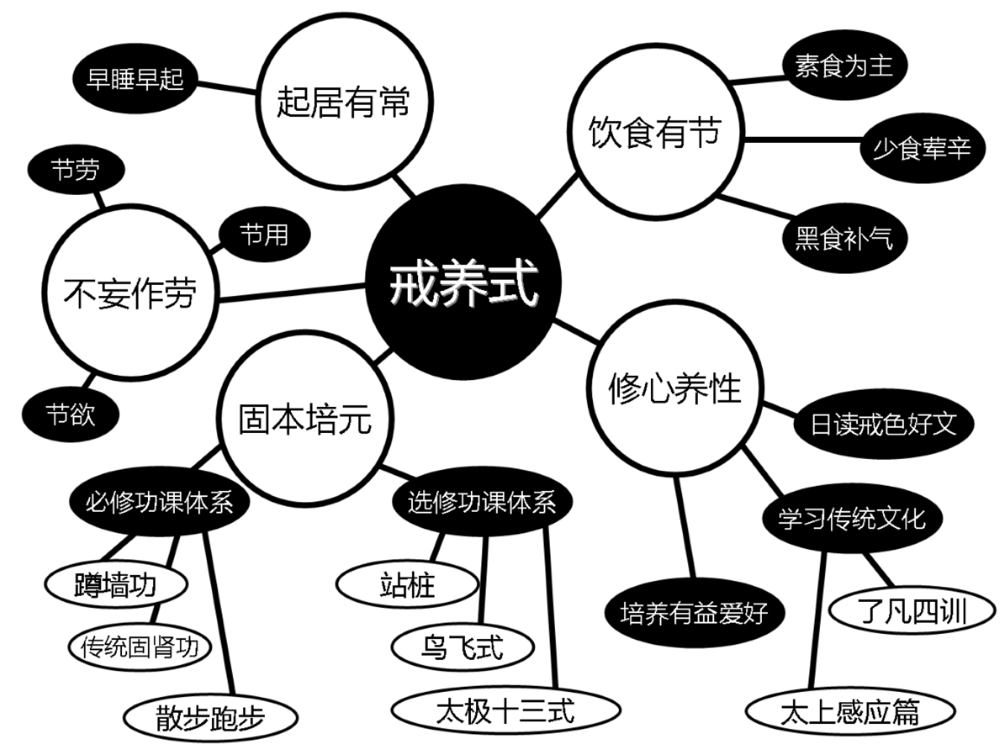
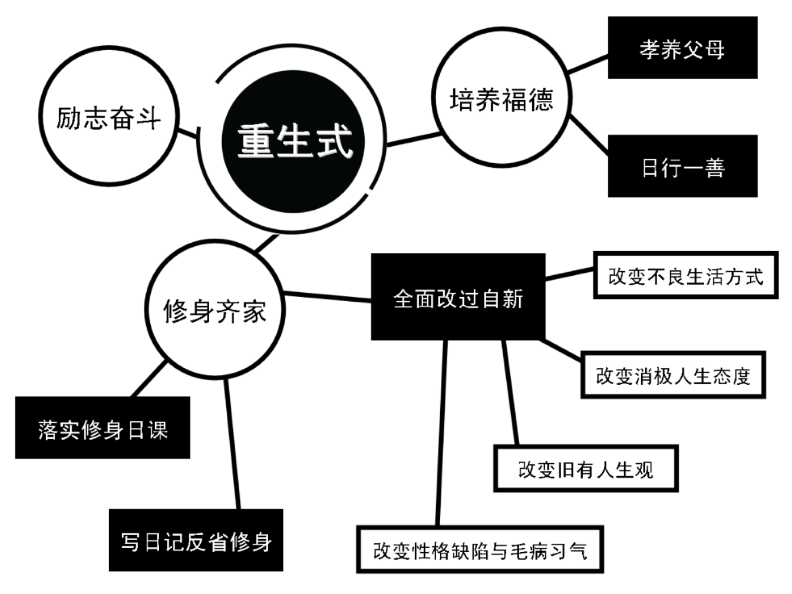

## “戒色系统工程论”实战手册----“三体式”戒色修身法

## 导    言  

要想成功戒除多年手淫恶习，必须依靠系统戒色方法才有成功可能。“‘戒色系统工程论’实战手册----‘三体式’戒色修身法”将系统戒色方法进一步体系化、简明化、量化、可操作化，内容与《“戒色系统工程论”解读——以“系统方法”成功戒手淫指南》（新版·附戒色图表）一文一脉相承，二者互相参究、实践，必能戒除手淫，获得清净自在的人生。

## 1、	“三体式戒色修身法”体系总揽

清心式、戒养式、重生式（远离色情、戒色养生、生命重建）是三位一体不可分割的有机整体，是系统的戒色、修身方法体系，故称“三体式戒色修身法”。“三体式戒色修身法” 以德为本，融合了儒、释、道三家的身心修养、修炼方法和传统中医身心一体、生理与心理互相影响之养生原理，以及武学、易经、阴阳五行之哲学思想，从身、心两者入手，性命双修，以达调理阴阳、平衡气血、固肾强身、正身养气、修德养性、生命重生之目的。

## 乙、“三体式戒色修身法”三大体系分论
## 一、清心式（远离色情）（3大法）
## （一）立誓养正（2中法）

#### 1、提升戒色认识
欲实践“三体式戒色修身法”戒色，先须认真阅读“系统戒色论”根本篇目《“戒色系统工程论”解读——以“系统方法”成功戒手淫指南》一文至少3--9遍以上，做摘抄笔记或打印下来，树立系统戒色的正确认识。

#### 2、宣读修身誓言
   
清晨洗漱完毕，面朝东方站立，双手抱拳当胸，如古人见面礼，以诚敬心面对东方虚空宣读修身誓言一遍：

我××（说出你的真实姓名），立誓从今日起，彻底远离手淫、色情，及一切不正当婚前性、婚外性行为，做一个品行端正、贤良有礼、乐善好施的谦谦君子（或窈窕淑女）；做一个言行无愧于天地、父母、兄弟、姊妹、朋友，孝悌守信、勇于担当、自强自立之人；做一个为天地立心、为生民立命、为往圣继绝学、为万世开太平的有益家、国之士。同时，愿世间所有人皆能远离手淫、色情、邪淫行为，获得清净、自在、健康、快乐的人生。

功效：东方在《易经》学中为生生不已之吉祥方位，双拳抱胸表示恭敬与诚意，本誓言包含宇宙正阳能量，以诚敬心面对东方虚空读此誓言一遍，虽未实行，当下即可体会浩然正气发自心胸，体内阳气随之发动。若能日日宣读此誓言必能长养浩然正气、培补体内阳气。

## （二）远离色情（3中法）

1、彻底删除自己电脑、手机里一切色情信息。包括色情图片、视频、电影小说等，同时毁掉家里色情碟片、书籍及身边所留存的一切与色情相关的东西。
    

 2、克服沉迷网络的习惯，彻底和黄色网站断绝关系。戒淫先戒心，戒心先戒目。除了上网查资料，无事不上网，上网不浏览色情图片、网站。

3、远离邪友、淫地。淫邪之友及有色情活动的美容院、休闲中心、舞厅、酒家、洗浴场所等淫地，皆当远离。

功效：彻底远离一切色情诱因，避免色情信息干扰心神，确保内心清净，是成功戒手淫的第一步，也是戒色成功的重要保障。

## （三）清心妙法
    
 推荐一个可以清净心念、降服淫心欲火、有助于戒意淫的清心咒语
 **（准提咒）**：

南无萨哆呐，三藐三菩陀，俱胝呐，达扎陀，嗡，折隶，主隶，准提，娑哈，嗡部楞。

南怀瑾先生示范的准提咒发音：
http://www.tudou.com/programs/view/e6Akx5mleY4/

准提咒发音剪辑合成mp3下载：
http://www.folou.com/thread-468254-1-1.html

功效：每日念诵此咒21遍或49、108遍，淫欲心会逐渐变淡变薄，有削弱淫心、降服淫念功效，同时又有培养福德好运、减少戒色障碍之奇效。此咒仅持一遍皆有不可思议效果，何况日日持诵。此咒好处参阅《方便之门——论被大家普遍忽视的戒色前辈常用“戒色利器”》。

【拈提】：“清心式”旨在长养浩然正气、培补阳气，避免色情信息勾引自心欲火升腾，造成戒色障碍，以保持内心清净、心君泰然，为生阳固肾、身体复原、成功戒色打下坚实基础。

## 二、戒养式（戒色养生）（5大法）

#### （一）起居有常 
晚上不睡“耗伤阳气”，早上不起“封杀阳气”，养成早睡早起的好习惯，晚上9、10点入睡，早上5、6点起床，肾精元气就能补足。
#### （二）饮食有节
饮食清淡，以素食为主，多食五谷杂粮、蔬菜水果、豆制品。尽量少食或不食肉食、油腻食物、刺激性食物（如葱、蒜、韭菜）等，避免这些荤腥食品刺激淫欲心爆发。多吃芝麻、香菇、黑豆、紫菜等黑色食物和各种养生粥，补肾益气。
### （三）不妄作劳
过度劳累不节制地消耗体力、精力会导致虚阳外越，耗掉人体阳气。平时连续学习、工作、娱乐40分钟后，就要休息活动10分钟，然后再继续。不可纵情声色、沉迷色欲，未婚者婚前禁欲，已婚者婚后节制房事次数。不久坐、不久视，节劳、节用、节欲，葆元毓神(保养肾精、元气，爱惜精神)，日常生活中随时注意劳逸结合“不妄作劳”，才有利于身心快速健康，符合戒色养生之道。

### （四）固本培元（2中法）
#### 1、必修功课体系（3小法）
（1）蹲墙功。一组30次，建议每天早上做1--5组，可根据自身实际选择组数。
  http://www.tudou.com/programs/view/oRvZk22F5Fg/

（2）传统固肾功。(彭鑫博士演示)一组30次，建议每天早上做1--5组，可根据自身实际选择组数。注意在练习固肾功时，动作要缓慢柔和、越慢越好，一分钟6次，才能达到畅通督脉、温补肾阳、固肾强身的目的。
http://v.ku6.com/show/pmUmdGML6e-UJ4uz.html

蹲墙功与传统固肾功两大健身功法为必修功课，日日坚持有补肾强身功效。

（3）散步、跑步。每日清晨散步2—5公里或跑步2—5公里，或晚饭后缓步慢行30—60分钟。动能生阳，“百练不如一走”，清晨散步时尽力迈开双腿迈大步行走（注意不可气喘吁吁），可拉开腿后面和后内侧膀胱经和肾经，有健脾、益肾功效。跑步,若早上空气质量不好，根据自身实际，学生可安排到下午或傍晚；上班族可安排到傍晚。深夜阳气收藏，不宜太晚跑步。

#### 2、选修功课体系（3小法）
（1）站桩：
浑圆桩：日站20—30分钟。
http://www.tudou.com/programs/view/UAd9kF_LYik/?tpa=dW5pb25faWQ9MTAyMjEzXzEwMDAwMl8wMV8wMQ(彭鑫博士演示)
http://v.ku6.com/show/pnCuCSHEtIt43kO1L-wx4A...html
http://v.youku.com/v_show/id_XNDQ1NjI3OTA4.html?tpa=dW5pb25faWQ9MTAyMjEzXzEwMDAwMl8wMV8wMQ
马步桩：日站10分钟（注：女子不宜站马步桩）
http://www.jiese.org/bbs/thread-13044-1-1.html
浑圆桩与马步桩可任选一种修练。

（2）鸟飞式。一组36次，建议做1--3组。南怀瑾先生示范的鸟飞式，有治疗失眠、肾虚、频繁梦遗之效。
http://my.tv.sohu.com/us/63271749/27874465.shtml

（3）太极十三式。（潘科名老师示范，南怀瑾文教基金会敬制）
    网址一：
http://www.nanhuaijinculturefoundation.org/movie.php?lang=cn&idept=12
网址二：
http://www.nanhuaijinculturefoundation.org/movieplay.php?lang=cn&pk=174
必修功课体系为每日必做功课，选修功课体系可自由选择其中一项或几项。单一功法的效果不会很明显，必修功课与选修功课结合起来，效果会大大加强。必修功课与选修功课可自由组合。

功效：蹲墙功、传统固肾功、散步、跑步、马步桩有升阳、固肾、强身功效；阳气生发后欲念随之而起易频繁梦遗，鸟飞式有化解频繁梦遗之效；浑圆桩、太极十三式为整体身心疗法。本“固本培元”功法体系包含之运动、养生诸多功法，有长养阳气、培补肾精、疏通经络气脉、平衡气血、固本培元、调动人体自身修复功能促进身体康复的功效，是非常科学、系统、完整的整体身心生命修复法，同时可培养积极的人生态度与坚强的意志，有助于彻底戒除手淫陋习。

### （五）修心养性（3中法）
#### 1、日读戒色好文

认真阅读、学习论坛推荐的置顶帖、精华帖、戒色前辈的成功经验贴。戒色初期，每天学习戒色文章1-2篇，吸取前辈成功经验，避免戒色走弯路、走错路。
视频 《色情泛滥的危害》(陈大惠）
http://v.youku.com/v_show/id_XMjQ3MzkxODc2.html
视频《伤身、败德、折寿的根本原因》（彭鑫博士）
    http://v.youku.com/v_show/id_XNDkzMjY5NDAw.html

#### 2、学习传统文化
《了凡四训》、《幸福人生讲座》（书、视频、mp3）为必修科目，《论语别裁》、《原本大学微言》、《寿康宝鉴》、《太上感应篇》、《俞净意公遇灶神记》等其他传统文化书籍为选修内容。
   
《了凡四训》（下载地址）（直接百度可搜到）
 《幸福人生讲座》（下载地址）（请上论坛搜索关键字获取下载地址）
   
功效：传统文化上合天心，为宇宙至真至正之理。常读好文、善书，学习中国古代传统文化，旨在修养德行、培养浩然正气。此心一正则邪不可干，同时可以树立正确、健康的人生观，以积极的态度立身处世，再造新生命。

#### 3、培养有益身心爱好
武术、健身、绘画、乐器、书法等。旨在陶冶性情，转移对色情的注意力。
【拈提】：“戒养式”旨在恢复肾精元气，调理阴阳、升阳固肾、平衡气血、强身健体、康复破败身体，提升心性德行，培补浩然正气、阳气，能有效对抗淫欲心、手淫习气。
## 三、重生式（生命重建）（3大法）
## （一）励志奋斗
戒色不仅仅是不手淫，而是重建新人生。当全部心思与精力都放在为理想、目标努力奋斗上，自然远离手淫行为。立志奋斗是很好的戒色方法。人生目标，可以是5年、3年、1年或下半年的奋斗目标。具体实施就是制定健身计划、学习计划、工作计划、人生计划，并认真落实。

### （二）修身齐家(3中法)
#### 1、落实修身日课
修身日课用来合理安排每日的闲暇时间，让自己忙碌、充实起来，自然远离色情与手淫行为。具体内容可参考《“戒色系统工程论”日课——‍“三体式戒色修身法”实践流程‍》，或自行制定。
#### 2、全面改过自新 (4小法)
（1）改变不良生活方式：从熬夜、久坐、久视、沉迷网络、玩手机、玩游戏、沉迷电视剧、酗酒嗜烟、结交损友中摆脱出来，转向早睡早起、锻炼运动、培养有益身心爱好、读好书、结交益友。方法是写日记自我监督。

（2）改变消极人生态度：从得过且过、混日子，安于现状、无志向，改为树立人生奋斗目标，每天为目标、理想而奋斗，重在落实。方法是写日记自我监督。

（3）改造旧有人生观：建立儒释道传统文化之新人生观，代替原来对宇宙人生的看法。方法是在学习《弟子规》和《了凡四训》的基础上，进一步深入学习儒释道传统文化，行善、布施、孝敬父母等。

（4）改造性格缺陷与毛病习气：懒惰、不爱劳动、做事拖沓、无恒心、无耐性、浮躁、幻想多、实干少、无容人之心、炫耀才智、善怒、不耐烦剧、自私自利等习气一一加以改正。方法是从洒扫庭除（打扫、整理庭堂院落或房间）入手，逐步改变诸多陋习，读好书、说好话、行好事、处处为别人着想。

##### 3、写日记反省修身
每晚坚持写戒色、修身日记，做戒色记录，反省一天言行过失。日日知非、日日改过，以求日日新。
推荐：
   《曾国藩：三十岁以前是庸人》（请上论坛搜索关键字获取下载地址）
   《曾国藩的修身艺术》（请上论坛搜索关键字获取下载地址）

   ### （三）培植福德(2中法)
#### 1、孝养父母

父母是我们每个人元气的根本。生机要想茁壮，要往根上浇水，这是肾气真正的总开关。从物质与精神两个层面孝养父母，符合天之道，身体阳气自动启发，身体就会恢复。

#### 2、日行一善 
善能生阳。日行一善，可以培养内在正气、阳气、福德，有效克制手淫之阴。常存利人之心，常行利人之举，久则正气存在，邪不可干，邪念自然远离。善事种类如：公交车上让座、捡起路上纸屑果皮、关掉学校或单位没有关紧的水龙头、未关闭的灯，给灾区捐款、济贫、助学、放生、帮助别人戒色等。

【拈提】：“重生式”旨在全面修身、提升德性，为自己积累阴德、培植福德，改善未来命运走势，是生命重生之法。

## 丙、“三体式戒色修身法”三大体系总摄 

 “三体式戒色修身法”三大体系符合天之道，内容层层递进，环环相扣，浑然一体，不可分割。整体实践可使戒色者身心系统到达水火既济、心君泰然、阴阳协调、身心康泰之最佳状态。

“三体式戒色修身法”三大式（模块）是系统科学的身、心全面修炼体系。若偏重锻炼养生，不重转化心性，难免阳气勃发之后，欲念加重有破戒之危险，必须以远离色情、修心养性、励志奋斗、修身齐家之心性修养功夫以化解之。若偏重转化心性，不重锻炼养生，难免身体阳气不足，生理阴气太盛又易反制心理，则阳气、志气、胆气、豪气全无，何以抗衡强大淫欲习气与阴性能量？身、心一体互为影响，故需全面修炼提升。又，培植福德可降低由于戒色者自身福德不足导致的重重戒色障碍，有顺水推舟、化解厄运、增阳气、增福气、增吉祥之奇效，是成功戒色的重要保障，戒色者不可不重视。

手淫者如同一个病人，多心理阴暗、身体破败、运气晦涩等病症，“三体式戒色修身法”的三大式（清心式、戒养式、重生式）就是有针对性的治疗法，可以阳光心态、补肾强身、调整运气，全方位的对症下药解决病症。“三体式戒色修身法”是一味戒色者必服之戒色良药，佐以《“戒色系统工程论”解读——以“系统方法”成功戒手淫指南》整体服食，必可拔出病根，药到病除，彻底戒除手淫、康复身体，改善运气。

“三体式戒色修身法” 不仅是一部戒色宝典，也是一部修身宝典、立命宝典。在成功戒手淫之后，本法仍有终生实践价值。戒除手淫获得健康，仅是实践本法的最粗浅好处，若终生勤习之还可以改变你的人生，命自我立、福自我求，再造新命运，获得生命重生！

[注1]：“清心式”中的“清心安神妙法”介绍的准提咒，也可用念诵“南无（na mo）观世音菩萨”圣号来代替，功效与准提咒等同，能有效克制意淫。《普门品》云：“若有众生多于淫欲，常念恭敬观世音菩萨便得离欲。”圣号若能每日常念，并祈求观世音菩萨护佑加被，效果定会彰显，淫欲心会越来越淡，直至彻底戒除手淫。

[注2]：《“三体式”戒色修身法》是众多戒色前辈成功经验的精华总结，兼容“自力”戒色（全靠自己）与“自力＋他力”戒色（借助佛力)两种戒色模式，为目前戒色界最根本、最有效的系统戒色大宗之法，具有普遍适用性与实战价值。本法所说为普遍原则，由于个体差异，大家在实践时可根据自身实际，在不违背本法大原则的前提下,部分细节可以灵活变通、调整。比如: 固本培元中的必修功课体系与选修功课体系所提出的健身法,可调整。

[注3]：实践《“三体式”戒色修身法》的戒友，一定要反复学习、领会《“戒色系统工程论”解读——以“系统方法”成功戒手淫指南》的戒色理念，才能将《“三体式”戒色修身法》的功效发挥到最大化、才能取得最佳的戒色效果。

## 	附录1：
###	《“三体式”戒色修身法》纲要
### 一、清心式（远离色情）（3大法）

#### 一）立誓养正（2中法）
1、提升戒色认识   
2、宣读修身誓言  
#### （二）远离色情（3中法）
1、彻底删除自己电脑、手机里一切色情信息。  
2、克服沉迷网络的习惯，彻底和黄色网站断绝关系。  
3、远离邪友、淫地。  
#### （三）清心妙法  
###二、戒养式（戒色养生）（5大法）
#### （一）起居有常
#### （二）饮食有节
#### （三）不妄作劳
#### （四）固本培元（2中法）
1、必修功课体系（3小法）  
（1）蹲墙功。  
（2）传统固肾功。  
（3）散步、跑步。  
2、选修功课体系（3小法）  
（1）站桩：浑圆桩、马步桩。  
（2）鸟飞式。  
（3）太极十三式。  
#### （五）修心养性（3中法）  
1、日读戒色好文  
2、学习传统文化  
3、培养有益身心爱好  
### 三、重生式（生命重建）（3大法）  	
#### （一）励志奋斗  
#### （二）修身齐家(3中法)
1、落实修身日课  
2、全面改过自新 (4小法)  
 （1）改变不良生活方式  
 （2）改变消极人生态度  
 （3）改造旧有人生观  
 （4）改造性格缺陷与毛病习气    
3、写日记反省修身    
#### （三）培植福德(2中法)  
1、孝养父母  
2、日行一善  
 

2、日行一善

### “三大式”图解： 
 

 

 

《“戒色系统工程论”解读——以“系统方法”成功戒手淫指南》(简称《戒色指南》)是 “系统戒色方法”《 “三体式”戒色修身法》的指导思想，《“三体式”戒色修身法》是《戒色指南》的具体体现，具有实战价值。二者关系紧密，互相参究，不可偏废。从本《纲要》入手，较容易掌握《“三体式”戒色修身法》的精髓，在实践本法基础上反复深入学习《戒色指南》，二者融会贯通，戒色必然成功。

### 附录2：     
#### 《“三体式”戒色修身法》日课‍实践流程‍

### 一、早上
 1、早上五点起来、洗漱（5分钟）  
 2、简单洒扫庭除（清理庭堂院落或房间5分钟）  
 3、读诵日课：  
 
 （1）面朝东方站立，双手抱拳当胸，如古人见面礼，以诚敬心面对东方虚空宣读戒色修身誓言一遍（见上文，熟读之后背诵）。
 
 （2）出声朗读《弟子规》或《太上感应篇》等传统文化修身书籍。  
 （3）读计划书一遍。（15分钟）

4、健身日课：  
    (1) 站桩20分钟左右，蹲墙功、传统固肾功，1组30次，建议每天早上各做1-5组，可根据自身实际选择组数。  
    (2) 散步或跑步2—5公里。  
    (3) 练太极拳。     
根据自己情况，任选一项或几项。身体虚弱者可适当减少运动量。（30--90分钟）。

【注：如果同时练站桩与蹲墙功，先站桩再练习蹲墙功为宜。如果先练习蹲墙功再站桩，站桩时两大腿肌肉会不断的抖动，影响站桩效果。】

5、把当天计划内要做的事写在纸上，或记在日历上。（2--3分钟）
### 二、白天
  甲、早饭前默念人生目标  
  乙、上学或上班路上心中默念清心咒语（准提咒），不计数（散持）  
甲、利用中午时间学习戒色文章、好书（30分钟）  
乙、放学或下班路上心中默念清心咒语（准提咒），不计数（散持）
丙、日行一善（最少做一件举手之劳就可以帮助他人之善举。如水龙头没关紧，人走灯未灭等浪费现象，都是你的机会。“勿以善小而不为”，行善不在大小，只要留心每天都有行善机会，就看你有没有这个心。碰到日行一善的机会要毫不犹豫，不要错失良机。日积月累则成大善。）

### 三、晚上  
1、饭后散步2—5公里（20--30分钟）  
2、读诵日课：  
（1）默念修身戒色誓言一遍、读计划书一遍。  
（2）阅读戒色、励志、修身、传统文化类书籍文章（30--40分钟）  
3、兴趣爱好：培养有益身心爱好（10--30分钟）  

4、健身日课：  
站桩20分钟左右，传统固肾功1-5组，鸟飞式1-3组，可根据自身实际选择组数（30--40分钟）

5、清心日课：
念诵“清心咒”（准提咒）21遍或49、108遍，计数（专念）。（10分钟左右）  

6、修身日记：
（1）睡前写日记，反省自己一天言行过失（5--10分钟）。
（2）当天计划要做的事，每完成一项，划去一项，因特殊或意外情况当天未完成者，可顺移至第二天完成（1—2分钟）

 7、洒扫庭除（清理庭堂院落或房间）5分钟。准备入睡，用热水泡脚（5分钟），十点之前入睡。

【注：本日课将一天闲暇时间充分利用起来，若严格执行生活就会充实起来，会感觉时间不够用，根本没时间胡思乱想，手淫、色情行为自然远离，不戒而戒。大家可在本日课基础上略做微调，制定符合自己实际的戒色修身日课】

## 附录3：
### 《“戒色系统工程论”体系》
1、《“戒色系统工程论”解读——以“系统方法”成功戒手淫指南》（戒色指南）

2、《“戒色系统工程论”实战手册----“三体式”戒色修身法》（日课流程）

3、《“戒色系统工程论”日课——每日必做功课》‍（日记模式）
