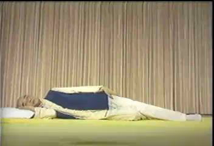
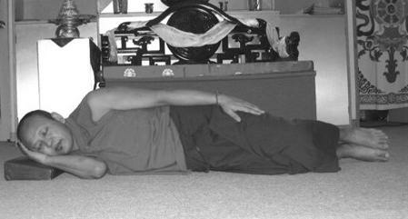

##  “吉祥卧”与 南怀瑾的“子午觉”

肾虚的人要想身体快速恢复健康，第一条也是最重要的一条就是：以正确的睡姿，在最高效的睡眠时间段入睡。因为中医养生学认为：养生之诀，当以睡眠居先；药补不如食补，食补不如睡补。睡补是天补，是第一大补药，比吃人参、燕窝、大补药的效果还好。

### 正确高效的睡姿“吉祥卧”

睡眠姿势有侧卧、仰卧、俯卧几种。各人的习惯不同，有人喜欢侧卧，有人喜欢仰卧等。从生理学和睡眠卫生的要求来说，以双腿弯屈朝右侧卧的睡姿，也就是“吉祥卧”，最有利于身心健康。

大家都看过《少林寺》这部电影，对于“站如松，坐如钟，行如风，卧如弓”这句话耳熟能详。这句话讲的内容其实是佛门里面的“四威仪”。“卧如弓”是指睡觉时右侧而卧，以足压足，右手垫在右脸颊下，左手放在左腿上，两腿像弓一样弯曲的右胁而卧的卧姿，这种睡姿叫做“吉祥卧”。

  

  
    南怀瑾老师示范

    

**一、佛经关于“吉祥卧”利益的论述**

“吉祥卧”睡觉姿势来源于佛家。根据佛说《长阿含经》卷第三游行经记载，释迦牟尼卧时就采取右侧卧的“吉祥卧”姿势，释迦牟尼涅槃时，就是选择这种姿势。世上许多雕塑的卧佛像都是右侧卧姿。

佛经记载“吉祥卧”有四种功德：第一、不会产生不如法的念头和行为(据我猜测应该是邪念、淫念、梦遗之类)。第二、睡眠中不会失去正念。第三，不会入于酣睡、深度昏沉，能时刻保持警觉的状态。第四，不起恶梦，经常做吉祥之梦。

佛家认为：脸朝上仰卧，易生贪心；脸朝下俯卧，易引发嗔心；左侧而卧，增长痴心。种种不如法的卧式，会引生各种无明烦恼，唯有右胁而卧才最有功德。

“吉祥卧”我很早就知道了。我一直在考虑一个问题：佛教为什么要提倡“吉祥卧”呢? 我猜测在生理方面，“吉祥卧”对身体肯定也是有好处的，里面一定是有科学依据的。由于佛门以修心为主，所以佛经关于“吉祥卧”的利益论述，更加偏重于修心方面，生理方面的好处佛经上没有全部说出来而已。果然，最后让我找到了“吉祥卧”在生理方面利益的科学原理。

**二、“吉祥卧”的科学原理、生理利益**

从科学角度讲，右卧的睡姿是一个健康的姿态，有它科学的原理依据：

（一）消除疲劳、回收阳气，长养精神。从生理学和睡眠卫生的要求来说，以双腿弯屈、朝右侧卧的睡姿最合适。这样会使全身肌肉松弛，有利于消除疲劳。我们睡觉的目的是为养精蓄锐，是让我们的阳气回收更加充足。右卧的时候，每个脏腑它就关闭了，自然可以养我们的精神。

（二）养心脏、利供血。心脏在胸腔内偏左，右侧睡心脏受压少，可减轻其负担，有利于排血。

（三）养肠胃，利于消化食物。胃通向十二指肠、小肠通向大肠的口都向右侧开，右卧有利于胃肠道内的食物顺利运行，把胃里边的东西都顺这个口送到肠里去，不会积在胃里边，不伤肠胃，利于消化食物。

（四）养肝、解毒。肝脏位于右上腹部，右侧卧时它处于低位，因此供应肝脏的血多，有利于对食物的消化，利于体内营养物质的代谢及药物的解毒，以及肝组织本身的健康等。

（五）不容易做淫梦、漏精、梦遗。人在吉祥卧的时候，就把三条脉的会聚点“三江口”折起来，一折起来，能量就往头上走了，人就不会有欲望了，就不容易漏精而发生梦遗现象。尤其是男子在这方面会受用无穷。仰卧、俯卧容易做淫梦，导致梦遗，而右卧可以减少淫梦，有效对治梦遗。据一位很有名气的大德讲，将左脚后跟搭在右脚的脚踝骨上可以对治梦中犯淫，大家可以试一试。

（六）利于入睡，提高睡眠质量。对于一些失眠的人，采用吉祥卧能很快入睡，而且无梦。仰睡、俯睡会增加身体的动荡烦噪，身体动荡，影响了生理，就无法安然。采取“吉祥卧”睡姿，身体不乱动，很快就入睡了。若是入睡前用温热水洗脚，能促进血液循环，更容易睡着。

“吉祥卧”要注意：睡的枕头不宜太低，否则会使颈部感到不适。

俯卧、仰卧的睡姿不利身心健康。俯卧会压迫我们的脏腑、压迫胸部，影响呼吸，使心肺工作量增加，故俯卧不利于健康。仰卧时我们的脏腑会打开，食物吃了之后压在上面，会伤害我们的肠胃。

“吉祥卧”的正确姿势：1、身体向右面侧卧；2、两腿合拢、微微弯曲；3、左手自然轻放在左大腿外侧上；4、右肘弯屈贴近胸肋，附枕而眠；5、把右手枕起来，大拇指放在耳朵后边，其余四指放在太阳穴的地方。把手当枕头，但并没有把耳朵盖起来（右手拇指伸开，把右手大拇指放在耳垂后面的凹陷中，食指和中指贴着左太阳穴，无名指、小指自然分开附于头侧）。有的人这样睡会把手压麻木了，可把手往前放一些，不压在头下。

“吉祥卧”可参考下图：

 

### 南怀瑾的“子午觉”

现代医学常识告诉我们，为保持正常体力，成年人平均睡眠的时间为8小时左右。
 世事总有出人意料之处。有位颇具传奇色彩的老人，则坚持每天只睡两个时辰（即4小时）。令人诧异的是，他非但没出现“睡眠亏空”，反而神康体泰，怡然得享高寿。他就是现已94岁高龄的名人大儒——南怀瑾先生。

南怀瑾，1918年生于浙江乐清一个书香门第，是誉满海内外的“禅宗大师”和“国学大师”，名列“台湾十大最有影响的人物”。他一生广泛涉猎经史子集，刻苦钻研中国传统文化之儒、释、道，著述颇丰，有《易经杂说》、《论语别裁》、《小言黄帝内经》、《大学微言》等数十种，有人对他著述讲学的一生给予高度评价：“经纶三大教，出入百家言。”

仔细推究，原来南怀瑾睡觉的两个时辰并非随随便便，而是有着严格的要求：子时（23～1点）和午时（11～13点）。他一生睡眠甚少，却精神强健，奥妙全在坚持“子午觉”。

何谓“子午觉”？简言之，就是每天子时和午时按时入睡(晚上9、10点睡觉，子时进入睡眠状态)，其主要原则是“子时大睡，午时小憩”。南怀瑾曾经“语出惊人”：“根据我的体验观察，一个人真正睡着觉最多只有两个钟头，其余都是浪费时间，躺在枕头上做梦……正午只要闭眼真正睡着三分钟，等于睡两个钟头……正子时，哪怕二十分钟也一定要睡……你会感觉到，心脏下面硬是有一股力量降下来，与丹田（肾上）的力量融合，所谓‘水火既济’，豁然一下，那你睡眠够了，精神百倍。”（详见《睡眠与养生》一文）

南怀瑾看似“卓尔不群”的睡眠理论，却并非空穴来风。传统中医理论认为：夜半子时为阴阳大会、水火交泰之际，称为“合阴”，是一天中阴气最重的时候。而白天午时，则是人体阳气最盛的时候，称为“合阳”。《黄帝内经》云：“阳气尽则卧，阴气尽则寐。”子、午时是人体“阴阳交替”之时，适合卧床休息，以利于“养阴”和“养阳”。
中医“子午流注”理论则认为，每日的12个时辰对应人体12条经脉，这和现代西医的“生物钟”理论暗合。它告诉我们：子时胆经当令，人在子时前入眠，胆方能完成代谢。“胆有多清，脑有多清”，子时入眠，晨醒后头脑清晰、气色红润。反之，则气色青白。如果胆汁新陈代谢长期紊乱，则易形成“结石症”。午时心经当令，“心主神明，开窍于舌，其华在面”。心气推动血液运行，人在午时能睡片刻，对于养心大有好处，可使下午乃至晚上精力充沛。“子午流注”理论从另一个侧面佐证了“子午觉”对人体的重要性。

南怀瑾平生钟爱“子午觉”的做法，给人重要启示：人体的健康全靠有规律的“养”。只有遵循人体经脉气血运行的自然规律，“饮食有节，起居有常”，方能使身体达成和谐，进入健康佳境。

现代人有熬夜的不良习惯，经常打乱“生物钟”，错过“子午觉”。长此以往，必然使身体处于亚健康状态。因此，为自己的健康“储蓄”，“子午觉”良训要谨记。

